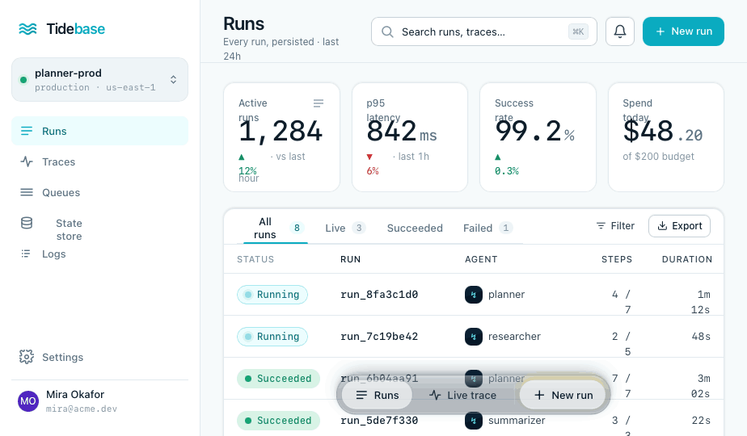

<p align="center">
  
</p>

<h1 align="center">Tidebase</h1>

<p align="center">
  Checkpointed runs, live state, gates, and usage tracking for existing agent workflows.
</p>

<p align="center">
  <a href="#quick-start">Quick start</a>
  ·
  <a href="#api-shape">API</a>
  ·
  <a href="#what-tidebase-stores">Storage contract</a>
  ·
  <a href="#current-scope">Scope</a>
</p>



<!--
Demo video:
Export the product film from the design-system video composition, upload the mp4/webm
to a GitHub issue, release, or README edit, then paste the generated URL here.
GitHub renders user-attachments video URLs as an embedded player.

Example:
https://github.com/user-attachments/assets/...
-->

Tidebase is a self-hosted run backend for long-running agent workflows.

Your code still runs in your app, worker, or job process. Tidebase stores checkpoints, state, events, gates, channel deliveries, recovery attempts, and usage records in Postgres so failed runs can resume from the last safe point without moving execution into a hosted runtime.

## Why Tidebase

Agent products usually grow the same operational plumbing:

- status tables for runs and steps
- checkpoint blobs for partial progress
- retry flags and manual-review states
- progress streaming to the UI
- approval gates for risky actions
- token and cost ledgers
- webhook glue for recovery and external review surfaces

Tidebase packages that layer around your existing code. It is not an LLM proxy, queue, hosted worker runtime, or secret broker.

## Quick Start

Start Postgres:

```bash
docker compose up -d postgres
```

Install dependencies:

```bash
pnpm install
```

Run the server and Studio:

```bash
pnpm dev
```

- Server: http://localhost:7373
- Studio: http://localhost:5173

Run the example workflow:

```bash
pnpm example
```

Force a failure after two completed checkpoints:

```bash
FAIL_WRITE=1 pnpm example
```

Copy the run id from Studio or the API, then resume:

```bash
TIDEBASE_RUN_ID=run_xxx pnpm example
```

The `plan` and `fetch-sources` steps are returned from checkpoints. Only `write-report` executes again.

## API Shape

```typescript
import { Tidebase } from '@tidebase/sdk'

const tide = new Tidebase()

await tide.run('generate-report', { runId }, async (run, input) => {
  const plan = await run.step('plan', () => makePlan(input))

  await run.state.set({
    status: 'writing',
    progress: 0.7
  })

  return run.step('write-report', () => writeReport(plan))
})
```

## Resume Contracts

Each step can declare the operational contract Tidebase should record for replay:

```typescript
await run.step(
  'send-email',
  {
    input: { userId },
    sideEffects: ['email.send'],
    idempotencyKey: `welcome:${userId}`,
    replay: 'auto',
    checkpointInvariant: 'provider accepted the message id',
    verifiedBy: 'email provider response'
  },
  () => sendWelcomeEmail(userId)
)
```

Tidebase records that contract with the step and shows it in Studio. Final step failures are classified as:

- `failed_retryable` when SDK retries remain.
- `manual_review` when replay is manual, or when side effects exist without an idempotency key.
- `failed` for hard failures.

This does not make external systems exactly-once. It makes the resume decision explicit instead of hiding it in logs and custom retry flags.

## Gates And Channels

Channels deliver Tidebase events to external surfaces. The alpha supports webhook channels:

```typescript
await tide.run(
  'generate-report',
  {
    input: { topic: 'channels' },
    channels: [{
      type: 'webhook',
      url: 'https://your-app.example.com/api/tidebase-events',
      events: ['run.failed', 'step.failed', 'gate.created']
    }]
  },
  workflow
)
```

Gates create durable approval decisions that can be resolved by Studio, a product UI, Slack/Teams adapter, internal tool, or local review page:

```typescript
const decision = await run.gate('approve-send', {
  prompt: 'Send this report to the customer?',
  data: { reportId },
  channels: [{ type: 'webhook', url: process.env.REVIEW_WEBHOOK_URL! }],
  capability: {
    name: 'report.send',
    scopes: ['report:send'],
    reason: 'agent wants to send an external report'
  }
})

if (decision.decision !== 'approved') {
  throw new Error('Report was not approved')
}
```

Webhook gate payloads include a `resolveUrl` and `resolveToken`. Credential and capability fields are audit metadata only; Tidebase does not store or broker API keys in this alpha.

Run a local approval channel:

```bash
pnpm example:review
```

In another terminal:

```bash
REQUIRE_APPROVAL=1 \
TIDEBASE_CHANNEL_WEBHOOK=http://localhost:8788/tidebase-events \
pnpm example
```

Open http://localhost:8788, approve the gate, and the workflow continues.

## Recovery Webhooks

Tidebase can call back into your app when a run fails and has a recovery webhook configured. The SDK can handle that webhook and resume the matching workflow.

```typescript
const run = await tide.runs.create('generate-report', {
  input: { topic: 'checkpoints' },
  recoveryWebhook: 'https://your-app.example.com/api/tidebase'
})
```

Tidebase records each recovery attempt with delivery status, HTTP status, response body, and errors. If `TIDEBASE_WEBHOOK_SECRET` is set on both the server and SDK, recovery payloads are signed with `x-tidebase-signature`.

The example includes a local webhook server:

```bash
pnpm example:webhook
```

## Usage Tracking

Tidebase can record generic resource usage for a run without proxying model or provider calls:

```typescript
await run.usage.record({
  kind: 'llm',
  provider: 'openai',
  model: 'gpt-4.1-mini',
  label: 'draft-response',
  inputTokens: 1200,
  outputTokens: 420,
  costUsd: 0.012
})
```

Usage records are stored with the run, emitted as `usage.recorded` events, and summarized in Studio. The same ledger can track non-LLM resources:

```typescript
await run.usage.record({
  kind: 'tool',
  provider: 'internal-search',
  quantity: 8,
  unit: 'queries',
  costUsd: 0.004
})
```

## What Tidebase Stores

- runs and attempts
- named checkpointed steps
- input hashes to prevent stale checkpoint reuse
- step resume contracts
- live state snapshots
- append-only run events
- recovery attempts
- webhook channel deliveries
- durable gates and decisions
- credential/capability audit metadata
- generic usage records for tokens, units, and cost

Everything is backed by Postgres and designed for self-hosting from day one.

## Current Scope

- Postgres-backed run store
- TypeScript SDK
- SvelteKit Studio
- live state set/patch
- SSE event stream
- signed recovery webhooks
- webhook channels
- durable gates
- usage/resource ledger
- dogfood workflow

## Not In This Alpha

- Tidebase-hosted code execution
- queues or worker deployment
- LLM gateway/proxying
- hosted channel adapters
- secret custody or credential brokering
- memory
- auth
- hosted cloud

## Alpha Notes

This is ready for local demos and early feedback, not production.

Important limits:

- The server currently auto-runs the SQL schema on boot; a real migration runner is planned.
- There is no API authentication yet. Run it only in trusted local/self-hosted environments.
- External side effects still need idempotency keys in user code.
- Tidebase remembers what happened and can call recovery webhooks, but it does not guarantee that user code will be available to resume.
